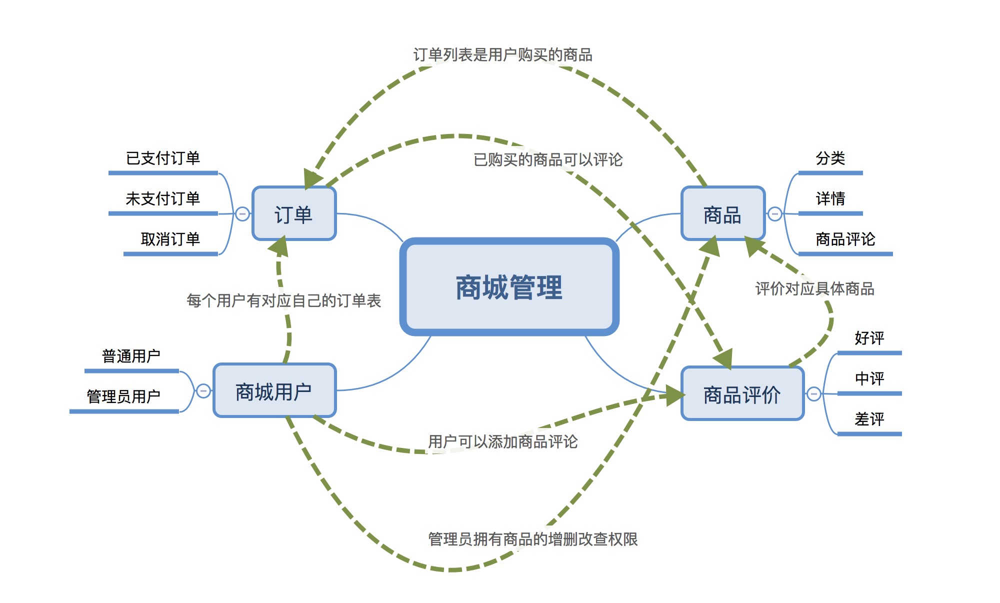

# Node + Express + Mongodb 实现全栈开发

> 本期主题为实现一个电商平台，项目架构为 Node + Express + Mongodb，其实服务器最好的选择为MYSQL，但是因为Mongodb相较于MYSQL，比较简单、好入门、容易部署，所以选择Mongodb，实际开发中使用的服务器肯定不是某一种，是包含各式各样的（不同服务器有各自不同的好处，所以会从中选择最优的使用）

## 主要课程包含

- 了解node、mongodb
- 环境搭建--安装node、mongodb、mongodb compass、postman
- 创建node应用并链接数据库
- 创建用户表--`新增用户`、`修改用户`
- 用户表---`查询用户列表`、`删除用户`
- 创建商品表---`新增商品`、`修改商品`
- 商品表---`商品列表`、`下架商品`
- 创建订单表
- 商品评论表

## 周期

4-6周

## 适合人群
> 想要学习node，对node想要进一步学习，有全栈想法

- 要求
对node有一定了解，有较好的js基础，了解（或想学习）mongodb，有较好的学习、理解能力

