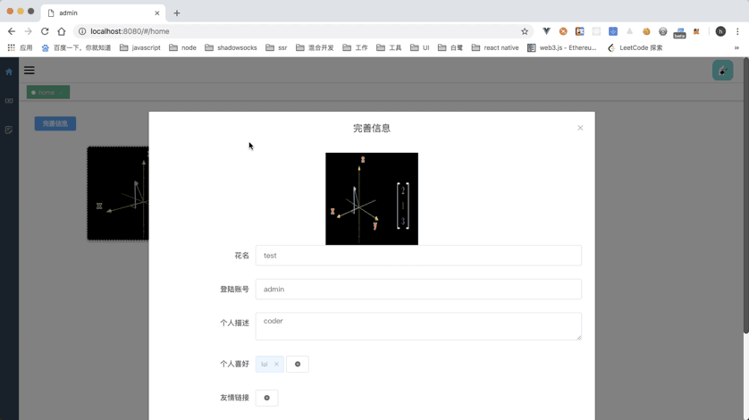

# 关于node实现文件上传



## 使用Multer

Multer 是一个 node.js 中间件，用于处理 multipart/form-data 类型的表单数据，它主要用于上传文件。它是写在 busboy 之上非常高效。

> 注意: Multer 不会处理任何非 multipart/form-data 类型的表单数据。

```shell
  npm install --save multer
```

### 使用方法

```javascript
var express = require('express')
var multer  = require('multer')
var upload = multer({ dest: 'uploads/' })

var app = express()
// 单文件上传
app.post('/profile', upload.single('avatar'), function (req, res, next) {
  // Do something
})

// 多文件上传
app.post('/photos/upload', upload.array('photos', 12), function (req, res, next) {
  // Do something
})

var cpUpload = upload.fields([{ name: 'avatar', maxCount: 1 }, { name: 'gallery', maxCount: 8 }])
app.post('/cool-profile', cpUpload, function (req, res, next) {
  // req.files 是一个对象 (String -> Array) 键是文件名，值是文件数组
  // Do something
})
```

#### `DiskStorage`

```javascript
  import multer from 'multer';

  var storage = multer.diskStorage({
    //设置上传文件路径,以后可以扩展成上传至七牛,文件服务器等等
    //Note:如果你传递的是一个函数，你负责创建文件夹，如果你传递的是一个字符串，multer会自动创建
    destination: config.uploadPath, //  process.cwd() + '/public/uploads'
    //TODO:文件区分目录存放
    filename: function (req, file, cb) {
      var fileFormat = (file.originalname).split(".");
      cb(null, fileFormat[0] + "." + fileFormat[fileFormat.length - 1]);
    }
  });

  //添加配置文件到muler对象。
  var upload = multer({
    storage: storage,
    //其他设置请参考multer的limits
    //limits:{}
  });
```

有两个选项可用，`destination` 和 `filename`。他们都是用来确定文件存储位置的函数。

`destination` 是用来确定上传的文件应该存储在哪个文件夹中。也可以提供一个 `string` (例如 `'/tmp/uploads'`)。如果没有设置 `destination`，则使用操作默认的临时文件夹

**注意:** 如果你提供的 `destination` 是一个函数，你需要负责创建文件夹。当提供一个字符串，multer 将确保这个文件夹是你创建的。

`filename` 用于确定文件夹中的文件名的确定。 如果没有设置 `filename`，每个文件将设置为一个随机文件名，并且是没有扩展名的 

**注意:** Multer 不会为你添加任何扩展名，你的程序应该返回一个完整的文件名。

每个函数都传递了两个请求 (`req`) 和一些关于这个文件的信息 (`file`) 有助于你的决定。

### `limits`

一个对象，指定一些数据大小的限制。Multer 通过这个对象使用 busboy，详细的特性可以在 [busboy's page](https://github.com/mscdex/busboy#busboy-methods) 找到。

可以使用下面这些:

Key | Description | Default
--- | --- | ---
`fieldNameSize` | field 名字最大长度 | 100 bytes
`fieldSize` | field 值的最大长度  | 1MB
`fields` | 非文件 field 的最大数量 | 无限
`fileSize` | 在 multipart 表单中，文件最大长度 (字节单位) | 无限
`files` | 在 multipart 表单中，文件最大数量 | 无限
`parts` | 在 multipart 表单中，part 传输的最大数量(fields + files) | 无限
`headerPairs` | 在 multipart 表单中，键值对最大组数 | 2000

设置 limits 可以帮助保护你的站点免受拒绝服务 (DoS) 攻击。

### `fileFilter`

设置一个函数来控制什么文件可以上传以及什么文件应该跳过，这个函数应该看起来像这样：

```javascript
function fileFilter (req, file, cb) {
  // 可以在这个方法里面进行文件类型判断，然后决定是否接受这个文件
  // 这个函数应该调用 `cb` 用boolean值来
  // 指示是否应接受该文件

  // 拒绝这个文件，使用`false`，像这样:
  cb(null, false)

  // 接受这个文件，使用`true`，像这样:
  cb(null, true)

  // 如果有问题，你可以总是这样发送一个错误:
  cb(new Error('I don\'t have a clue!'))

}
```

### 尾声
