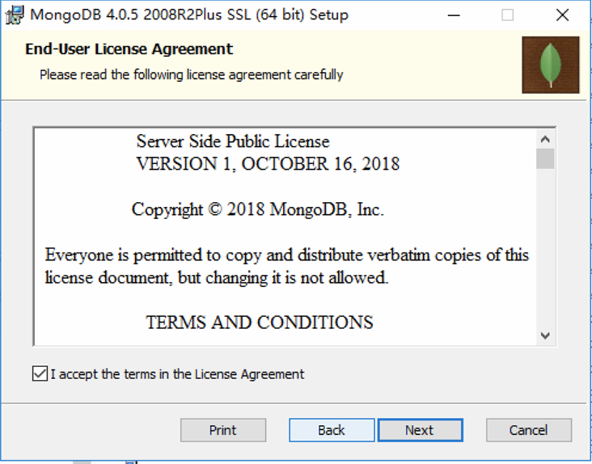
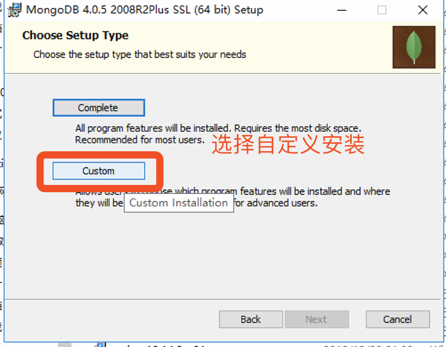
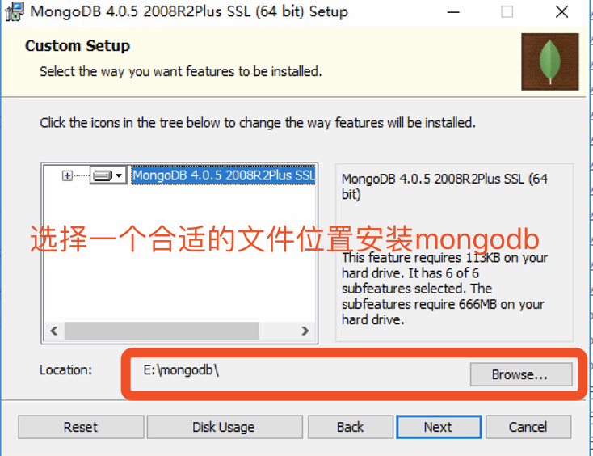
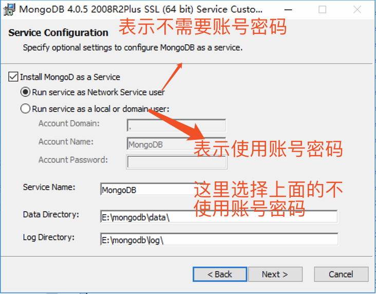
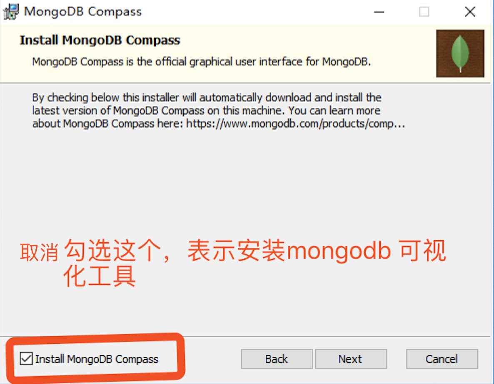
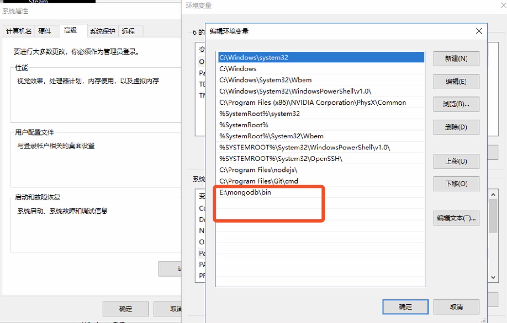
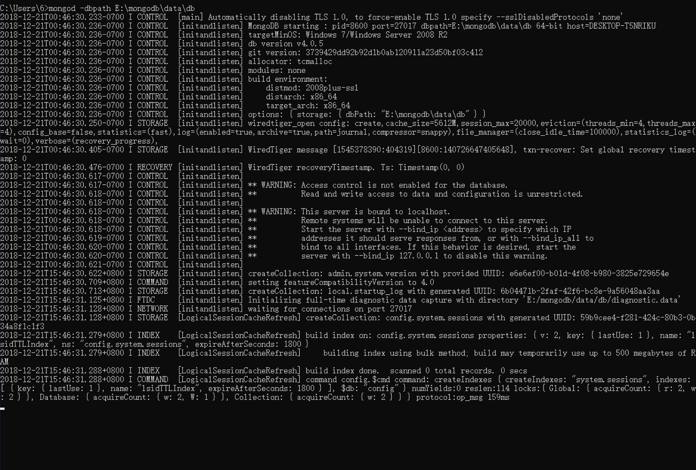
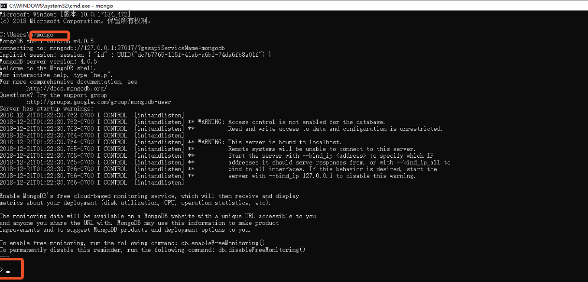
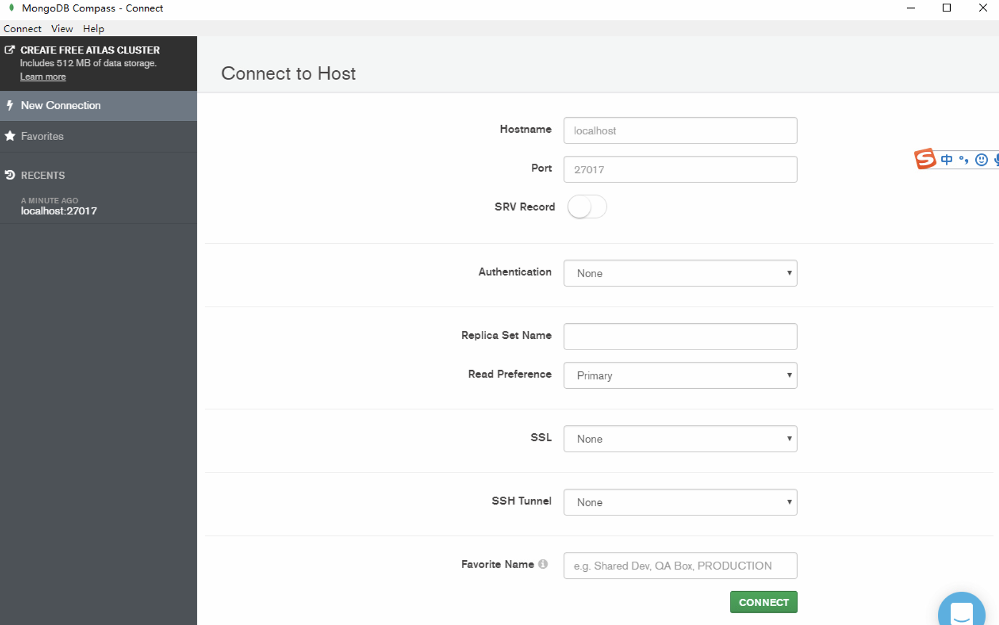
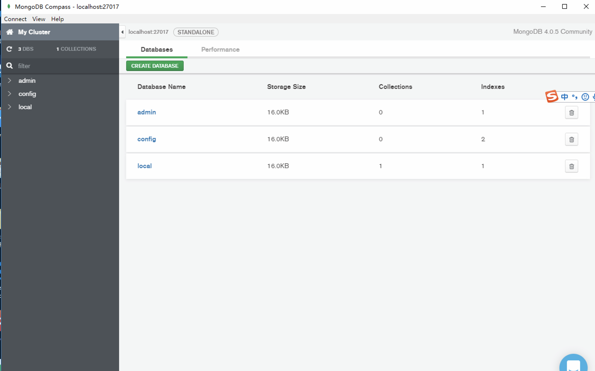

## 环境搭建 

> mongodb、mongodb compass、postman、vscode

### mongodb

[下载地址](https://www.mongodb.com/download-center/community)
> 根据自己的操作系统选择自己合适的镜像进行下载

具体操作如图







*安装完成之后，在mongodb的data文件夹下 新建db文件夹*

#### 配置环境变量

这里填写的环境变量是我们mongodb安装的文件位置

配置完成后，打开cmd执行：

```shell
mongod -dbpath E:\mongodb\data\db
// dbpath后面跟的是你mongodb安装的地址
```


新开一个cmd命令窗口 <span style="color: red">上一个窗口不要关闭</span>

```shell
// 执行mongo
mongo
```

出现👇表示安装正确



### mongodb compass

[下载地址](https://www.mongodb.com/download-center/compass)

下载安装即可




成功如上图

### postman

[下载链接](https://www.getpostman.com/apps)

### vscode

[下载链接](https://code.visualstudio.com/)


### mac 环境配置

打开终端

```shell
brew install mongod
//安装完成之后查看mongod
where is mongod

// 使用vim 编辑~/.bash_profile
// 在最后面添加环境变量

//例如
export PATH=/usr/local/bin/mongod/bin:$PATH

//保存退出
// 使配置生效
source ~/.bash_profile

mongod
// 新开一个终端

mongo
```

有问题 随时问我